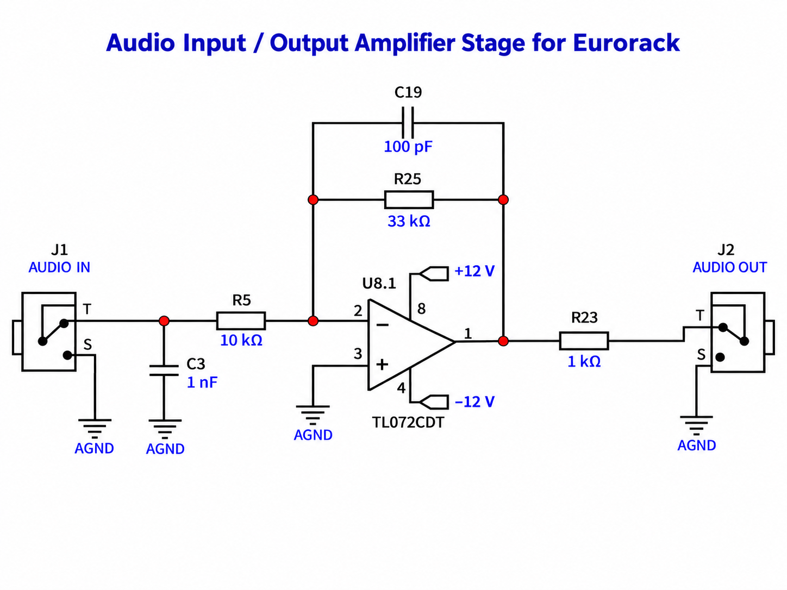

# ESP32 DAC to modular synth audio interface

This project is an analog amplifier stage intended to connect the audio output of an ESP32 DAC to a modular synthesizer. Its purpose is to amplify the DAC signal for use in a Eurorack audio signal path.

## How it works

The schematic shows one half of a TL072CDT op-amp powered from +12 V and −12 V, with its non-inverting input connected to analog ground (AGND). The DAC signal enters at AUDIO IN and passes through R5 (10 kΩ) to the inverting input. R25 (33 kΩ) provides feedback, giving an ideal low-frequency gain of:

`Vout = −(33 kΩ / 10 kΩ) × Vin = −3.3 × Vin`

The stage therefore amplifies the signal and reverses its polarity. C19 (100 pF), across the feedback resistor, reduces gain at high frequencies. C3 (1 nF) connects the input to ground to shunt high-frequency content; its effect depends on the source impedance. R23 (1 kΩ) is in series with AUDIO OUT, so the connected load also affects the delivered output level.

The intended signal path is **ESP32 DAC → AUDIO IN → amplifier → AUDIO OUT → modular synth audio input**, with a shared signal ground.

## TL072CP alternative and bill of materials

The **TL072CP** can be used as an alternative to the TL072CDT for this amplifier with the shown **±12 V supply**. Both use the same pin numbering: pin 8 is +12 V, pin 4 is −12 V, and the first amplifier uses pins 1 (output), 2 (inverting input), and 3 (non-inverting input). The resistor and capacitor values can remain the same.

The package is different: **TL072CP is through-hole DIP-8**, suitable for a breadboard or DIP socket; **TL072CDT is surface-mount SO-8**. A PCB must use the footprint for the selected package; these are not physically interchangeable on the same pads. See the [TI TL072CP product page](https://www.ti.com/product/TL072/part-details/TL072CP), [TI TL072 datasheet](https://www.ti.com/lit/ds/symlink/tl072.pdf), and [ST TL072 datasheet](https://www.st.com/resource/en/datasheet/tl072.pdf).

This substitution is based on the manufacturer documentation, not a hardware test of this circuit. It does not resolve the DAC DC-offset handling described below.

**[View the bill of materials on GitHub](BOM.md)** or [download the original spreadsheet](Eurorack_audio_amp_BOM.xlsx). The TL072CP substitution is documented here and in the Markdown BOM.

## Integration status

This drawing is a starting point for the interface, not a tested complete ESP32 module. In particular, it does not show AC coupling or a circuit to remove the DAC's DC offset. Any DC voltage at the input is also amplified and inverted, which must be accounted for when setting the output level and available headroom. The ESP32 model, DAC output range, and desired modular audio level still need to be specified.

Power-supply decoupling, treatment of the unused op-amp channel, connector details, and the complete ESP32 connection also need to be documented before building the finished interface. This project currently contains no editable KiCad schematic or PCB layout, and no simulation or hardware test results are recorded.

## Files

- [schematic.png](schematic.png): reference drawing of the amplifier stage.
- [BOM.md](BOM.md): GitHub-readable bill of materials and circuit notes.
- [Eurorack_audio_amp_BOM.xlsx](Eurorack_audio_amp_BOM.xlsx): existing bill of materials spreadsheet.
- [STATUS.md](STATUS.md): project status and remaining work.

The circuit description above is based on the supplied schematic image. Manufacturer documentation was consulted for the TL072CP substitution; the complete circuit has not undergone datasheet validation or hardware testing.
